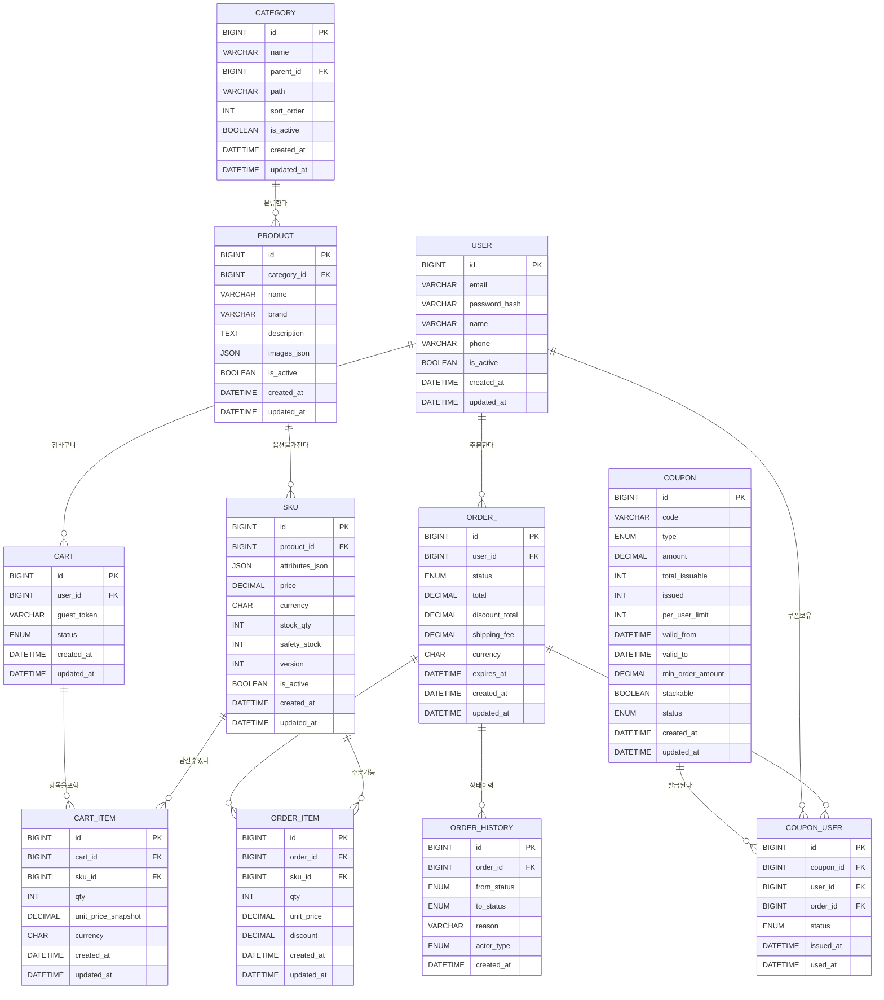

# ERD

```mermaid
erDiagram
%% NOTE: Mermaid에서 예약어 충돌을 피하기 위해 order 테이블은 order_ 로 표기합니다. (실제 테이블명: `order`)

    USER {
        BIGINT id PK
        VARCHAR email
        VARCHAR password_hash
        VARCHAR name
        VARCHAR phone
        BOOLEAN is_active
        DATETIME created_at
        DATETIME updated_at
    }

    CATEGORY {
        BIGINT id PK
        VARCHAR name
        BIGINT parent_id FK
        VARCHAR path
        INT sort_order
        BOOLEAN is_active
        DATETIME created_at
        DATETIME updated_at
    }

    PRODUCT {
        BIGINT id PK
        BIGINT category_id FK
        VARCHAR name
        VARCHAR brand
        TEXT description
        JSON images_json
        BOOLEAN is_active
        DATETIME created_at
        DATETIME updated_at
    }

    SKU {
        BIGINT id PK
        BIGINT product_id FK
        JSON attributes_json
        DECIMAL price
        CHAR currency
        INT stock_qty
        INT safety_stock
        INT version
        BOOLEAN is_active
        DATETIME created_at
        DATETIME updated_at
    }

    CART {
        BIGINT id PK
        BIGINT user_id FK
        VARCHAR guest_token
        ENUM status
        DATETIME created_at
        DATETIME updated_at
    }

    CART_ITEM {
        BIGINT id PK
        BIGINT cart_id FK
        BIGINT sku_id FK
        INT qty
        DECIMAL unit_price_snapshot
        CHAR currency
        DATETIME created_at
        DATETIME updated_at
    }

    ORDER_ {
        BIGINT id PK
        BIGINT user_id FK
        ENUM status
        DECIMAL total
        DECIMAL discount_total
        DECIMAL shipping_fee
        CHAR currency
        DATETIME expires_at
        DATETIME created_at
        DATETIME updated_at
    }

    ORDER_ITEM {
        BIGINT id PK
        BIGINT order_id FK
        BIGINT sku_id FK
        INT qty
        DECIMAL unit_price
        DECIMAL discount
        DATETIME created_at
        DATETIME updated_at
    }

    ORDER_HISTORY {
        BIGINT id PK
        BIGINT order_id FK
        ENUM from_status
        ENUM to_status
        VARCHAR reason
        ENUM actor_type
        DATETIME created_at
    }

    COUPON {
        BIGINT id PK
        VARCHAR code
        ENUM type
        DECIMAL amount
        INT total_issuable
        INT issued
        INT per_user_limit
        DATETIME valid_from
        DATETIME valid_to
        DECIMAL min_order_amount
        BOOLEAN stackable
        ENUM status
        DATETIME created_at
        DATETIME updated_at
    }

    COUPON_USER {
        BIGINT id PK
        BIGINT coupon_id FK
        BIGINT user_id FK
        BIGINT order_id FK
        ENUM status
        DATETIME issued_at
        DATETIME used_at
    }

%% Relationships (카디널리티 표기)
    CATEGORY ||--o{ PRODUCT : "분류한다"
    PRODUCT  ||--o{ SKU     : "옵션을가진다"

    USER     ||--o{ CART    : "장바구니"
    CART     ||--o{ CART_ITEM : "항목을포함"
    SKU      ||--o{ CART_ITEM : "담길수있다"

    USER     ||--o{ ORDER_    : "주문한다"
    ORDER_   ||--o{ ORDER_ITEM: "상품을포함"
    SKU      ||--o{ ORDER_ITEM: "주문가능"

    ORDER_   ||--o{ ORDER_HISTORY : "상태이력"

    COUPON   ||--o{ COUPON_USER : "발급된다"
    USER     ||--o{ COUPON_USER : "쿠폰보유"
    ORDER_   ||--o{ COUPON_USER : "사용주문(선택)"

```