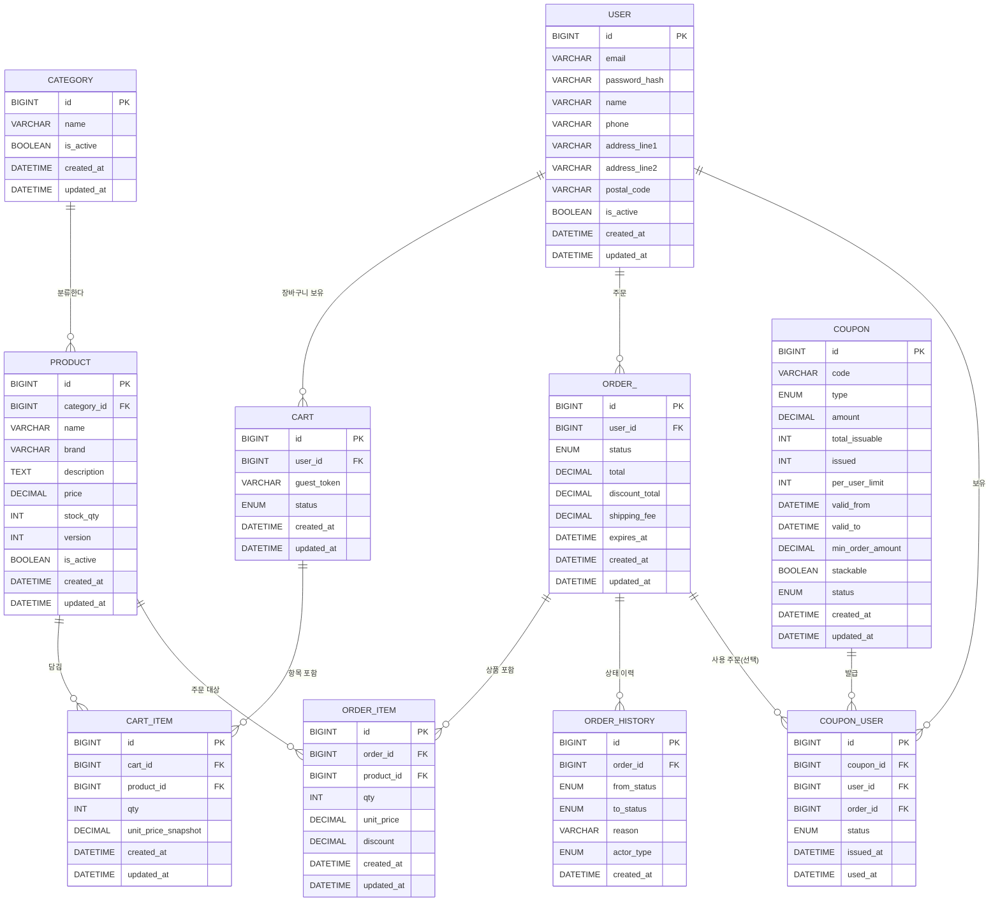

# ERD

```mermaid
erDiagram
%% NOTE: Mermaid 예약어 충돌을 피하기 위해 order 테이블은 ORDER_ 로 표기합니다. (실제명: `order`)

    USER {
        BIGINT id PK
        VARCHAR email
        VARCHAR password_hash
        VARCHAR name
        VARCHAR phone
        VARCHAR address_line1
        VARCHAR address_line2
        VARCHAR postal_code
        BOOLEAN is_active
        DATETIME created_at
        DATETIME updated_at
    }

    CATEGORY {
        BIGINT id PK
        VARCHAR name
        BOOLEAN is_active
        DATETIME created_at
        DATETIME updated_at
    }

    PRODUCT {
        BIGINT id PK
        BIGINT category_id FK
        VARCHAR name
        VARCHAR brand
        TEXT description
        DECIMAL price
        INT stock_qty
        INT version
        BOOLEAN is_active
        DATETIME created_at
        DATETIME updated_at
    }

    CART {
        BIGINT id PK
        BIGINT user_id FK
        VARCHAR guest_token
        ENUM status
        DATETIME created_at
        DATETIME updated_at
    }

    CART_ITEM {
        BIGINT id PK
        BIGINT cart_id FK
        BIGINT product_id FK
        INT qty
        DECIMAL unit_price_snapshot
        DATETIME created_at
        DATETIME updated_at
    }

    ORDER_ {
        BIGINT id PK
        BIGINT user_id FK
        ENUM status
        DECIMAL total
        DECIMAL discount_total
        DECIMAL shipping_fee
        DATETIME expires_at
        DATETIME created_at
        DATETIME updated_at
    }

    ORDER_ITEM {
        BIGINT id PK
        BIGINT order_id FK
        BIGINT product_id FK
        INT qty
        DECIMAL unit_price
        DECIMAL discount
        DATETIME created_at
        DATETIME updated_at
    }

    ORDER_HISTORY {
        BIGINT id PK
        BIGINT order_id FK
        ENUM from_status
        ENUM to_status
        VARCHAR reason
        ENUM actor_type
        DATETIME created_at
    }

    COUPON {
        BIGINT id PK
        VARCHAR code
        ENUM type
        DECIMAL amount
        INT total_issuable
        INT issued
        INT per_user_limit
        DATETIME valid_from
        DATETIME valid_to
        DECIMAL min_order_amount
        BOOLEAN stackable
        ENUM status
        DATETIME created_at
        DATETIME updated_at
    }

    COUPON_USER {
        BIGINT id PK
        BIGINT coupon_id FK
        BIGINT user_id FK
        BIGINT order_id FK
        ENUM status
        DATETIME issued_at
        DATETIME used_at
    }

%% Relationships
    CATEGORY ||--o{ PRODUCT : "분류한다"
    USER     ||--o{ CART : "장바구니 보유"
    CART     ||--o{ CART_ITEM : "항목 포함"
    PRODUCT  ||--o{ CART_ITEM : "담김"

    USER     ||--o{ ORDER_ : "주문"
    ORDER_   ||--o{ ORDER_ITEM : "상품 포함"
    PRODUCT  ||--o{ ORDER_ITEM : "주문 대상"
    ORDER_   ||--o{ ORDER_HISTORY : "상태 이력"

    COUPON   ||--o{ COUPON_USER : "발급"
    USER     ||--o{ COUPON_USER : "보유"
    ORDER_   ||--o{ COUPON_USER : "사용 주문(선택)"

```