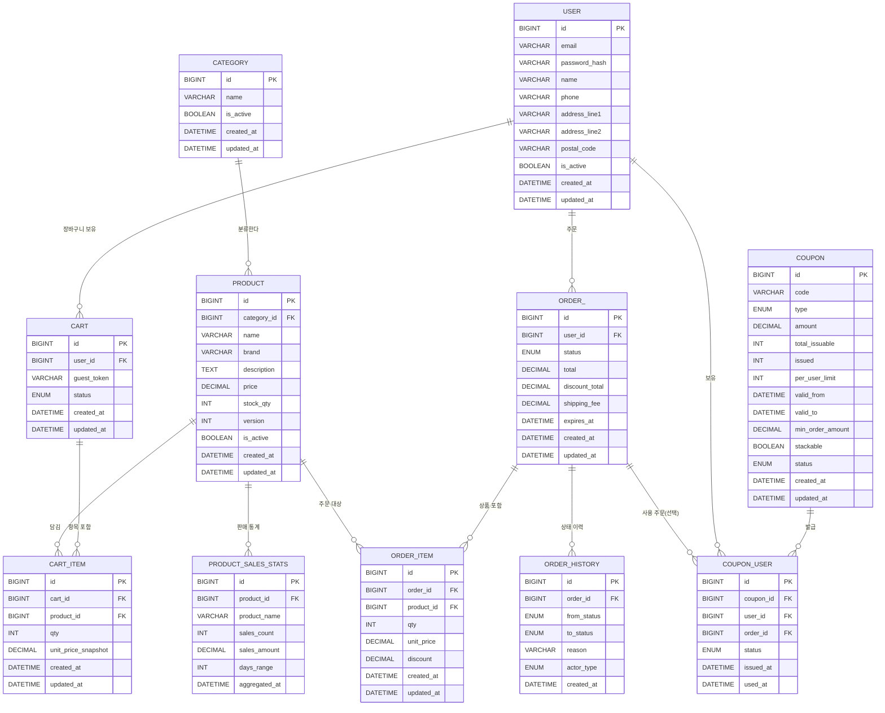

# ERD



---

## 📌 인덱스 전략

### 1. 성능 최적화 인덱스

#### USER 테이블
```sql
CREATE INDEX idx_user_email ON USER(email);  -- 로그인 조회
```

#### PRODUCT 테이블
```sql
CREATE INDEX idx_product_category ON PRODUCT(category_id, created_at DESC);  -- 카테고리별 조회
CREATE INDEX idx_product_active ON PRODUCT(is_active, created_at DESC);      -- 활성 상품 조회
```

#### ORDER 테이블
```sql
CREATE INDEX idx_order_user_created ON ORDER_(user_id, created_at DESC);  -- 사용자별 주문 조회
CREATE INDEX idx_order_status ON ORDER_(status, created_at DESC);         -- 상태별 조회
CREATE INDEX idx_order_expires ON ORDER_(expires_at);                     -- 만료 주문 조회
```

#### CART 테이블
```sql
CREATE INDEX idx_cart_user ON CART(user_id, status);  -- 사용자별 장바구니 조회
CREATE INDEX idx_cart_guest ON CART(guest_token);     -- 비회원 장바구니 조회
```

#### COUPON_USER 테이블
```sql
CREATE UNIQUE INDEX uk_coupon_user ON COUPON_USER(coupon_id, user_id);  -- 중복 발급 방지
CREATE INDEX idx_coupon_user_status ON COUPON_USER(user_id, status);    -- 사용자별 쿠폰 조회
```

#### PRODUCT_SALES_STATS 테이블
```sql
CREATE INDEX idx_stats_days_sales ON PRODUCT_SALES_STATS(days_range, sales_count DESC);    -- 판매량 순위
CREATE INDEX idx_stats_days_revenue ON PRODUCT_SALES_STATS(days_range, sales_amount DESC); -- 매출액 순위
CREATE UNIQUE INDEX uk_stats_product_days ON PRODUCT_SALES_STATS(product_id, days_range);  -- 중복 집계 방지
```

---

## 🔐 제약조건

### UNIQUE 제약조건
- `COUPON.code` - 쿠폰 코드 중복 방지
- `COUPON_USER(coupon_id, user_id)` - 동일 쿠폰 중복 발급 방지
- `PRODUCT_SALES_STATS(product_id, days_range)` - 동일 기간 중복 집계 방지

### CHECK 제약조건
- `PRODUCT.stock_qty >= 0` - 음수 재고 방지
- `COUPON.issued <= COUPON.total_issuable` - 발급 수량 초과 방지
- `ORDER_.total >= 0` - 주문 금액 음수 방지