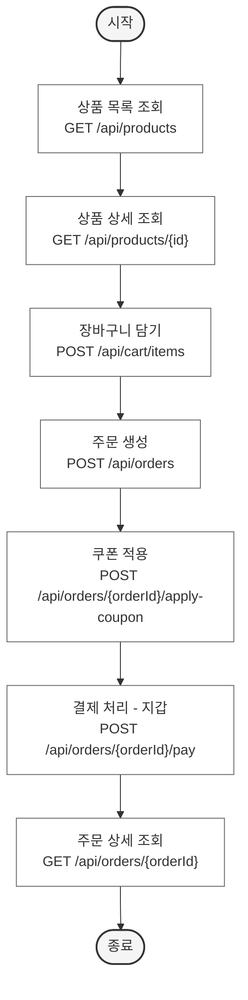

# FlowChart
| 행위   | 주요 API                                    |
|------| ----------------------------------------- |
| 상품 목록 조회 | GET `/api/products`                       |
| 상품 상세 조회 | GET `/api/products/{id}`                  |
| 장바구니 담기 | POST `/api/cart/items`                    |
| 주문 생성 | POST `/api/orders`                        |
| 쿠폰 적용    | POST `/api/orders/{orderId}/apply-coupon` |
| 결제 처리    | POST `/api/orders/{orderId}/pay`          |
| 주문 상태 조회 | GET `/api/orders/{orderId}`               |

