# 시쿼스 다이어그램

## 🛍️ 상품 조회 (목록 / 상세 / 인기 Top5)

### 상품 목록 조회

```mermaid
sequenceDiagram
    autonumber
    participant PC as ProductController
    participant PS as ProductService
    participant PR as ProductRepository
    participant AR as AnalyticsRepository

    rect rgb(245,245,245)
        Note over PC: GET /api/products
        PC->>PS: listProducts(filter, sort)
        PS->>PR: findProducts(filter, sort)
        PR-->>PS: 상품 데이터 목록
        PS-->>PC: 상품 목록 조회
    end

```

### 상품 상세 조회

```mermaid
sequenceDiagram
    autonumber
    participant PC as ProductController
    participant PS as ProductService
    participant PR as ProductRepository
    participant AR as AnalyticsRepository

    rect rgb(245,245,245)
        Note over PC: GET /api/products/popular?days=3&limit=5
        PC->>PS: getPopularProducts(3, 5)
        PS->>AR: findTopBySalesOrRevenue(3d, 5)
        AR-->>PS: 인기 상품 데이터
        PS-->>PC: 인기 상품 TopN 조회
    end

```

### 3일간 인기 상품 TOP 5 조회

```mermaid
sequenceDiagram
    autonumber
    participant PC as ProductController
    participant PS as ProductService
    participant PR as ProductRepository
    participant SR as SkuRepository
    participant AR as AnalyticsRepository

    rect rgb(245,245,245)
        Note over PC: GET /api/products/popular?range=3d&top=5
        PC->>PS: getPopularProducts(3d, 5)
        PS->>AR: findTopByRevenue(range=3d, limit=5)
        AR-->>PS: 인기 상품 데이터
        PS-->>PC: 인기 상품 Top5 조회 결과
    end
```

## 🛒 장바구니 (담기 / 수정 / 삭제)

### 장바구니 담기

```mermaid
sequenceDiagram
    autonumber
    participant CC as CartController
    participant CS as CartService
    participant CR as CartRepository
    participant CIR as CartItemRepository
    participant PR as ProductRepository

    rect rgb(245,245,245)
        Note over CC: POST /api/cart/items {productId, qty}
        CC->>CS: addItem(userId|guestToken, productId, qty)
        CS->>PR: getForPriceAndStock(productId)
        PR-->>CS: 상품 정보(현재가/재고)
        CS->>CR: findOrCreateActiveCart(owner)
        CR-->>CS: 장바구니
        CS->>CIR: findByCartAndProduct(cartId, productId)
        alt 이미 존재
            CS->>CIR: 수량 증가 및 단가 스냅샷 갱신
        else 신규
            CS->>CIR: 항목 저장(단가 스냅샷 포함)
        end
        CS-->>CC: 장바구니 항목 추가 완료
    end

```

### 장바구니 수정

```mermaid
sequenceDiagram
    autonumber
    participant CC as CartController
    participant CS as CartService
    participant CR as CartRepository
    participant CIR as CartItemRepository
    participant PR as ProductRepository

    rect rgb(245,245,245)
        Note over CC: PATCH /api/cart/items/{itemId}
        CC->>CS: changeQty(itemId, qty)
        CS->>CIR: updateQty(itemId, qty)
        CIR-->>CS: 수량 변경 결과
        CS-->>CC: 장바구니 항목 수정 완료
    end

```

### 장바구니 삭제

```mermaid
sequenceDiagram
    autonumber
    participant CC as CartController
    participant CS as CartService
    participant CR as CartRepository
    participant CIR as CartItemRepository
    participant PR as ProductRepository

    rect rgb(245,245,245)
        Note over CC: DELETE /api/cart/items/{itemId}
        CC->>CS: removeItem(itemId)
        CS->>CIR: delete(itemId)
        CIR-->>CS: 삭제 완료
        CS-->>CC: 장바구니 항목 삭제 완료
    end


```

## 📦 주문 생성 (장바구니 → 주문 / 주문항목 / 이력)

```mermaid
sequenceDiagram
    autonumber
    participant OC as OrderController
    participant OS as OrderService
    participant CR as CartRepository
    participant CIR as CartItemRepository
    participant PR as ProductRepository
    participant OR as OrderRepository
    participant OIR as OrderItemRepository
    participant OHR as OrderHistoryRepository

    Note over OC,OS: POST /api/orders
    OC->>OS: createOrder(userId|guestToken)
    OS->>CR: findActiveCart(owner)
    CR-->>OS: 장바구니
    OS->>CIR: findItems(cartId)
    CIR-->>OS: 장바구니 항목 목록

    par 재고/가격 최종 검증
        loop 각 항목
            OS->>PR: getForPriceAndStock(productId)
            PR-->>OS: 상품 정보(가격/재고/버전)
            OS->>OS: 재고/금액 검증 및 합계 계산
        end
    end

    OS->>OR: 주문 저장(status=PENDING, totals, expires_at)
    OR-->>OS: 주문 ID
    loop 각 항목
        OS->>OIR: 주문 항목 저장(productId, qty, unit_price, discount)
    end
    OS->>OHR: 상태 이력 기록(from=null, to=PENDING, reason=created)
    OS-->>OC: 주문 생성 완료

```

## 🎫 쿠폰 적용 (유효성 검증 → 할인 반영)

```mermaid
sequenceDiagram
    autonumber
    participant OC as OrderController
    participant OS as OrderService
    participant COR as CouponRepository
    participant CUR as CouponUserRepository
    participant OR as OrderRepository
    participant OHR as OrderHistoryRepository

    Note over OC: POST /api/orders/{orderId}/apply-coupon
    OC->>OS: applyCoupon(userId, orderId, code)
    OS->>COR: findByCode(code)
    COR-->>OS: 쿠폰 정책(기간/유형/금액/상태/최소금액)
    OS->>CUR: findByCouponAndUser(couponId, userId)
    CUR-->>OS: 사용자 쿠폰 상태(발급/사용/만료)

    alt 쿠폰 유효
        OS->>OR: updateTotalsWithCoupon(orderId, discount)
        OR-->>OS: 할인 반영 완료
        OS->>OHR: 상태 이력 기록(reason=couponApplied)
        OS-->>OC: 쿠폰 적용 완료
    else 쿠폰 무효
        OS-->>OC: 쿠폰 유효성 실패
    end

```

## 💸 결제 (잔액 확인 → 재고 차감 → 상태 변경)

