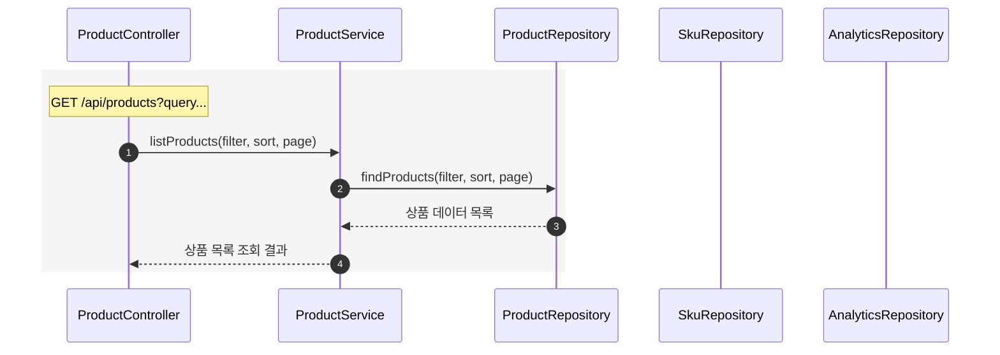
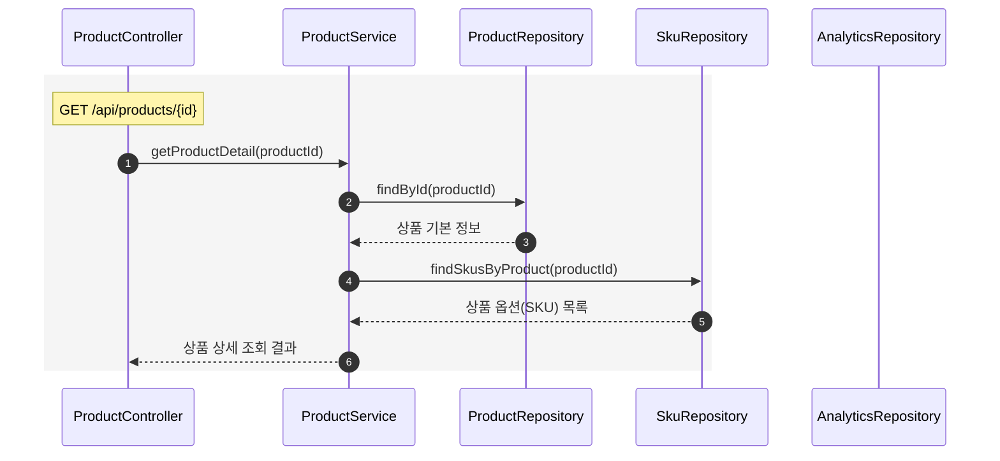
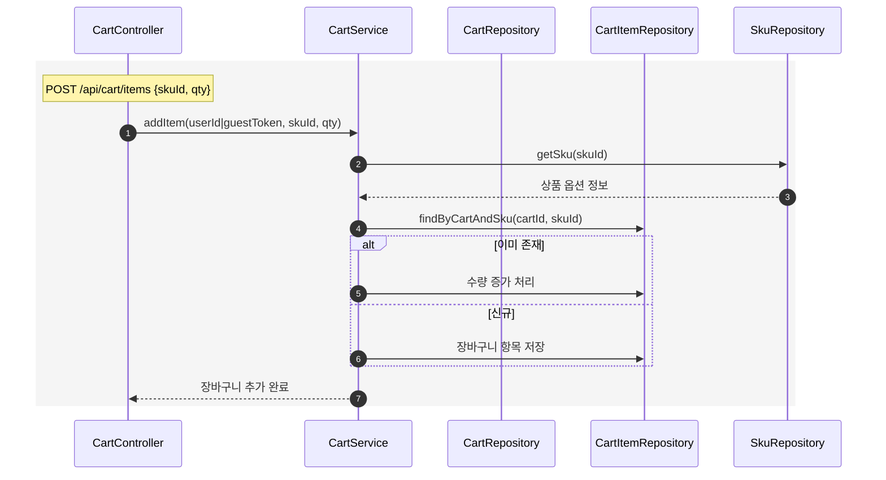
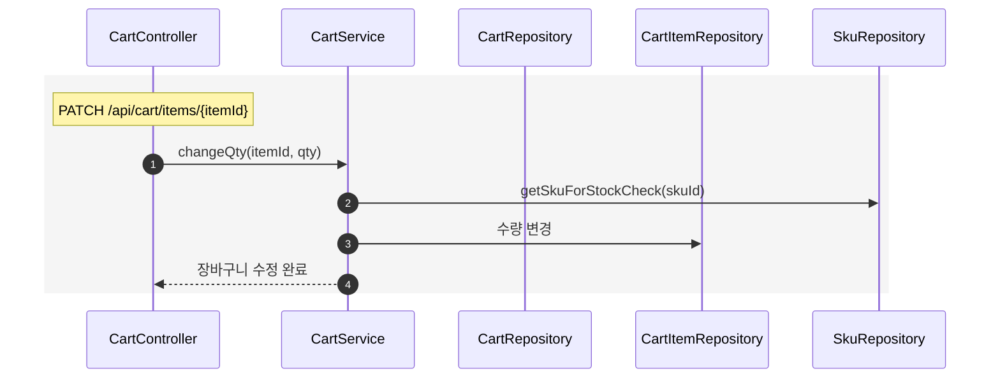
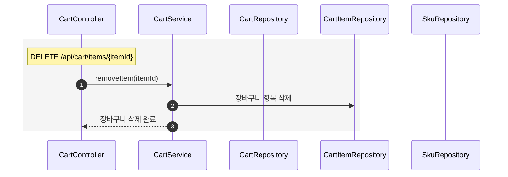
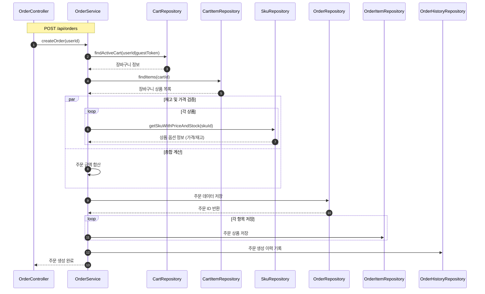
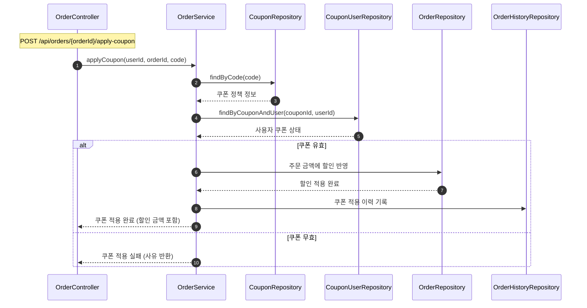
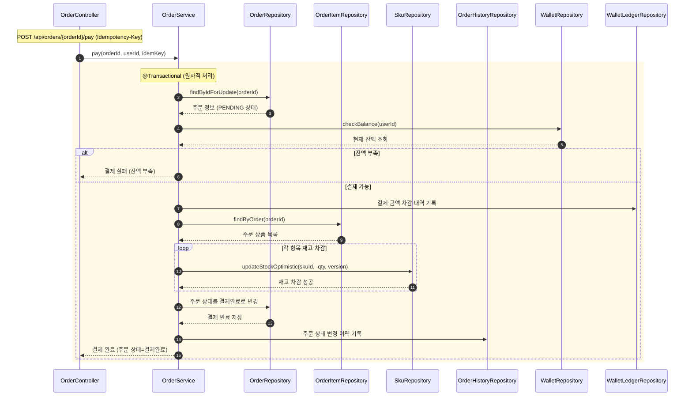

# 시쿼스 다이어그램

## 🛍️ 상품 조회 (목록 / 상세 / 인기 Top5)

### 상품 목록 조회

### 상품 상세 조회

### 3일간 인기 상품 TOP 5 조회

## 🛒 장바구니 (담기 / 수정 / 삭제)

### 장바구니 담기

### 장바구니 수정

### 장바구니 삭제

## 📦 주문 생성 (장바구니 → 주문 / 주문항목 / 이력)

## 🎫 쿠폰 적용 (유효성 검증 → 할인 반영)

## 💸 결제 (잔액 확인 → 재고 차감 → 상태 변경)

